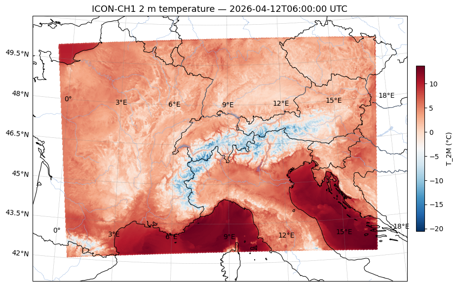

[](https://github.com/martibosch/meteoswiss-nwp-store/blob/main/LICENSE)

# MeteoSwiss NWP Store

A framework for building cloud-optimised operational analysis archives from [ICON-CH](https://www.meteoswiss.admin.ch/weather/weather-and-climate-from-a-to-z/icon.html) forecasts, using [meteodatalab](https://github.com/MeteoSwiss/meteodata-lab) to fetch data from the [MeteoSwiss Open Data API](https://opendatadocs.dmi.govcloud.dk/en/DMIOpenData), [icechunk](https://icechunk.io) for versioned cloud storage, and [Modal](https://modal.com) for serverless scheduling.

## Overview



*ICON-CH1 2 m temperature at 1 km resolution over Switzerland, plotted from an icechunk store using xarray and cartopy. Reproduced from [`notebooks/store-access.ipynb`](notebooks/store-access.ipynb).*

```
MeteoSwiss OGD API
      │
      │  meteodatalab (per variable, per model run)
      ▼
┌──────────────────────┐
│   Modal cron job     │  configurable schedule per grid/level
│  ingest_icon_ogd.py  │  probe ref_time → dedup check → fetch → write
└──────────┬───────────┘
           │  icechunk (zarr v3 + git-like versioning)
           ▼
┌──────────────────────────────────────────┐
│           S3-compatible storage          │
│                                          │
│  one icechunk store per configuration:   │
│  model × level × variable subset         │
└──────────┬───────────────────────────────┘
           │
           ├── direct access (icechunk + S3 credentials)
           │
           └── ArrayLake (optional catalog + auth layer)
                         │
                         └── xarray.open_zarr(store)
```

### Key features

- **Composable stores**: create one store per grid (CH1 at 1 km, CH2 at 2.1 km), level (`ml` for model levels, `sfc` for surface fields), or any custom variable subset — e.g. a lightweight store with only `T_2M` and `TOT_PREC` for downstream applications.
- **Operational analysis archive**: only analysis fields (lead time = 0) are stored, building a consistent `ref_time` time series that grows automatically with each model run.
- **Variable selection**: pass `--variables T,U,V` at the CLI to ingest only the variables you need, without changing the store schema.
- **Deduplication**: each run probes `ref_time` with a single cheap API request before fetching any data; duplicate snapshots are silently skipped.
- **Immutable versioning**: every write is a git-like snapshot. Bad ingestions can be audited and rolled back to any previous state without touching the stored data.
- **Flexible access**: stores are plain zarr v3 and can be read directly with icechunk and S3 credentials, or via [ArrayLake](https://docs.earthmover.io) for managed access and repo discovery.

## Setup

### Required accounts and credentials

| Service                                | Purpose                          | Required |
| -------------------------------------- | -------------------------------- | -------- |
| [Tigris](https://www.tigrisdata.com)   | S3-compatible object storage     | Yes      |
| [Modal](https://modal.com)             | Serverless compute for cron jobs | Yes      |
| [ArrayLake](https://app.earthmover.io) | Catalog and managed store access | Optional |

### 1. Install pixi

```bash
curl -fsSL https://pixi.sh/install.sh | sh
pixi install
```

### 2. Configure Modal

```bash
pixi run modal setup
```

Create a Modal secret named `meteoswiss-nwp-store-tigris` with your S3 credentials:

```
AWS_ACCESS_KEY_ID=<access-key>
AWS_SECRET_ACCESS_KEY=<secret-key>
AWS_REGION=auto
AWS_ENDPOINT_URL=https://fly.storage.tigris.dev
```

### 3. Create the icechunk stores

> **Without ArrayLake**: skip this step — stores are created automatically on first ingestion. Access them directly with icechunk and S3 credentials.

With ArrayLake, initialise each store as a managed repo:

```bash
pixi run just create-al-repo-ch1-anl-ml
pixi run just create-al-repo-ch2-anl-ml
pixi run just create-al-repo-ch1-anl-sfc
pixi run just create-al-repo-ch2-anl-sfc
```

### 4. Deploy the cron jobs

```bash
pixi run just deploy
```

This registers four scheduled Modal functions (CH1 every 3 h, CH2 every 6 h, for both `ml` and `sfc` levels). Stop them at any time with:

```bash
pixi run just stop
```

### 5. Trigger a manual ingestion (optional)

```bash
pixi run just ingest-ch2-anl-ml
```

Ingest only a subset of variables:

```bash
modal run -m meteoswiss_forecast_store.ingest_icon_ogd \
    --model ch2 --level ml \
    --bucket <bucket> --prefix <prefix> \
    --variables T,U,V
```

### ArrayLake (optional)

Authenticate once, then open any store as a managed repo:

```bash
pixi run arraylake login
```

```python
import arraylake, xarray as xr

client = arraylake.Client()
repo = client.get_repo("martibosch/meteoswiss-icon-ch2-anl-sfc")
ds = xr.open_zarr(repo.readonly_session("main").store, consolidated=False)
```

See [`notebooks/store-access.ipynb`](notebooks/store-access.ipynb) for a full walkthrough including direct icechunk access, version history, and a cartopy plot.

## Cost estimation

Rough monthly figures for the default four-store configuration (CH1 + CH2, `ml` + `sfc`, all variables). All estimates assume [Tigris](https://www.tigrisdata.com/docs/pricing/) storage pricing and [Modal](https://modal.com/pricing) on-demand compute.

### Data volume per snapshot

| Store     | Approx. size | Cadence            | Monthly growth     |
| --------- | ------------ | ------------------ | ------------------ |
| CH1 `ml`  | ~3.8 GB      | every 3 h (8×/day) | ~910 GB            |
| CH1 `sfc` | ~0.5 GB      | every 3 h (8×/day) | ~120 GB            |
| CH2 `ml`  | ~0.9 GB      | every 6 h (4×/day) | ~110 GB            |
| CH2 `sfc` | ~0.15 GB     | every 6 h (4×/day) | ~18 GB             |
| **Total** |              |                    | **~1.16 TB/month** |

### Storage (Tigris, ~$0.02/GB/month)

Cumulative storage grows at ~1.16 TB/month. After one month the storage bill is approximately **$23/month**, rising linearly as the archive extends.

### Compute (Modal)

Each ingestion run takes up to 10 minutes (timeout). Monthly container-minutes:

| Store            | Runs/month | Max min/month  |
| ---------------- | ---------- | -------------- |
| CH1 `ml` + `sfc` | 240 each   | 4 800          |
| CH2 `ml` + `sfc` | 120 each   | 2 400          |
| **Total**        | **720**    | **~7 200 min** |

At Modal's on-demand rate (~$0.07/GB-hour for a 2 GB container) this amounts to roughly **$17/month** at full timeout — in practice ingestion completes well under 10 minutes so actual costs will be lower. Modal's free tier ($30/month credit) covers this entirely for a new account.

### Summary

| Item                           | Estimated cost/month                              |
| ------------------------------ | ------------------------------------------------- |
| Tigris storage (after 1 month) | ~$23                                              |
| Modal compute                  | ~$10–17                                           |
| ArrayLake (optional)           | see [pricing](https://docs.earthmover.io/pricing) |
| **Total**                      | **~$33–40**                                       |

> Costs scale down significantly if you limit the variable set or restrict ingestion to CH2 only. A CH2-only, surface-only store with a handful of variables costs well under $5/month.
